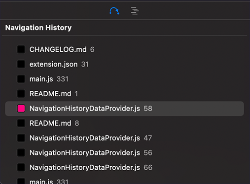
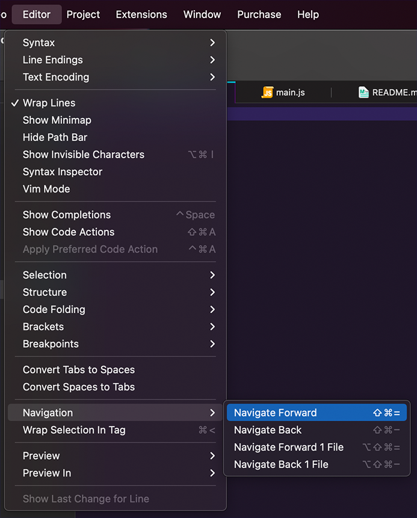

# Navigation Extension for NOVA IDE

This an extension for the Nova IDE that enables hotkeys for navigating backward and forward through your code!

includes a Sidebar to see your navigation history

## Details

This was designed to emulate the Navigate>Back/Forward functionality you'd typically see in other IDEs.

Some care has been taken to ensure this works alright in Split views, but as of now it's not well battle-tested.

| Menu Item              | Binding         |                        |
| ---------------------- | --------------- | ---------------------- |
| **Navigate Backward**  | `Shift-⌘--`     | "Shift+Command+Minus"  |
| **Navigate Forward**   | `Shift-⌘-=`     | "Shift+Command+Equals" |
| **Navigate Backward 1 File**  | `Shift-option-⌘--`     | "Shift+Option+Command+Minus"  |
| **Navigate Forward 1 File**   | `Shift-option-⌘-=`     | "Shift+Option+Command+Equals" |

This extension is making some guesses whether you've opened a file, or moved your cursor in a 100ms loop.  

Heavily inspired by https://github.com/eahanson/trail.novaextension ... a lot of additional work was done to ensure waypoints are created automatically. Enjoy!

Feedback is appreciated :)
Please report issues to the github repo - https://github.com/robochase6000/navigation.novaextension/issues

